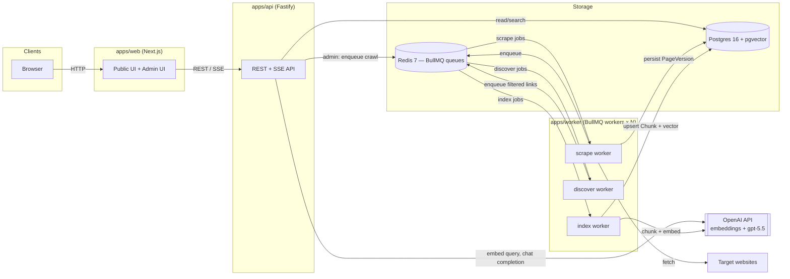
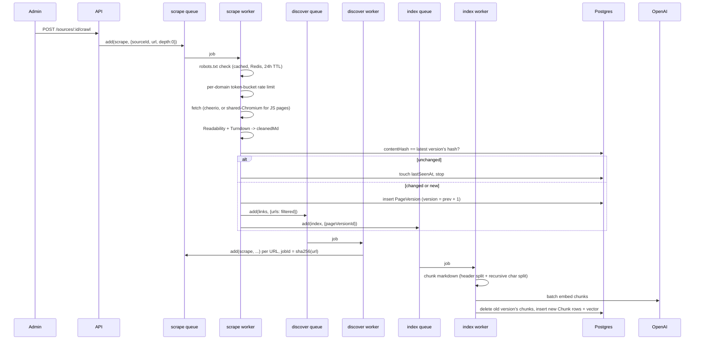

# Architecture

## Overview

The system is a distributed, queue-coordinated web scraper with content
versioning, hybrid (keyword + semantic) search, and RAG-based question
answering. It runs as five independently deployable services sharing one
Postgres database and one Redis instance:



Workers are horizontally scalable and stateless — any number of `worker`
container replicas can consume the same three queues (`scrape`, `discover`,
`index`) concurrently; BullMQ guarantees at-most-one-active-consumer per job.

---

## Why queue-coordinated, not framework-coordinated

Crawl frameworks like Crawlee ship their own in-process request queue,
which is not shared across containers — using it for coordination would
make horizontal scaling impossible. Here the fetch layer is deliberately
thin and all coordination lives in Redis:

- BullMQ (`scrape`, `discover`, `index` queues on Redis) owns all
  cross-worker coordination, retries, backoff, and the dead-letter queue.
- Each `scrape` job fetches exactly one URL — `fetch` + cheerio for static
  pages, or a **shared headless Chromium** (one browser per worker process,
  one fresh context per fetch — `packages/scraper/src/playwright-fetch.ts`)
  for JS-rendered ones, picked per `Source.renderJs` — then hands newly
  discovered links back to BullMQ as a `discover` job.

## URL lifecycle (scrape → discover → index)



Key invariants:

- **Never overwrite history.** A changed page gets a new `PageVersion` row
  (`version` incremented); nothing is updated in place.
- **Content dedup, not just URL dedup.** `contentHash = sha256(cleanedMd)`
  is compared against the page's latest version before writing — an
  unchanged re-crawl only bumps `lastSeenAt`.
- **Discover-job dedup.** `discover` jobs use `jobId = sha256(url)` so
  concurrently-discovered duplicate links collapse into one `scrape` job
  without a DB round trip.
- **Retries.** Every queue uses 5 attempts with exponential backoff
  (2s → 4s → 8s → 16s → 32s). Jobs that exhaust retries land in BullMQ's
  failed state (the DLQ) and are visible/retryable from `/admin/dlq`.

## Content pipeline (packages/processor)

`rawHtml` → strip `<table>` elements → `@mozilla/readability` (falls back to
raw body extraction for listing/catalog pages Readability can't parse, e.g.
`books.toscrape.com` category pages) → `turndown` (+ GFM plugin) →
`cleanedMd`. Tables are extracted separately (`packages/processor/tables.ts`,
Cheerio → array-of-objects JSON) and stored in `PageVersion.tables` rather
than left as inline HTML, then re-emitted as their own `TABLE`-type chunks
during indexing with a synthesized caption line.

## Indexing pipeline (packages/rag)

```
cleanedMarkdown
  → split on # / ## / ### headings, retaining heading as chunk metadata
  → per section: recursive character split (js-tiktoken token counting,
    chunkSize=800 tokens, overlap=150)
  → tables become their own chunks (ChunkType.TABLE), prefixed with a
    caption line, bypassing the text splitter
  → OpenAI text-embedding-3-small, batched
  → upsert into Chunk (raw SQL — pgvector's `vector(1536)` column isn't a
    native Prisma type) with a generated tsvector column for keyword search
```

Re-indexing on a new `PageVersion` deletes the previous version's chunks
first (`clearChunksForVersions`) so only the latest version is ever
searchable — old versions stay in Postgres for the diff viewer but drop out
of search/RAG.

**Important operational note:** because `embedding` and the generated
`content_tsv` column are added via raw SQL migrations rather than modeled in
`schema.prisma` (Prisma has no native pgvector type), running
`prisma migrate dev` against a populated database will detect them as drift
and offer to drop them. Always use `prisma migrate deploy` to apply
checked-in migrations; never `migrate dev` outside initial schema design.

## Retrieval and RAG (packages/rag)

Three search modes, all reachable via `GET /search?mode=` and used
internally by `/ask`:

- **`keyword`** — Postgres full-text search against the generated
  `tsvector` column (GIN-indexed).
- **`semantic`** — pgvector cosine similarity (`vector_cosine_ops`,
  HNSW-indexed) against the embedded query.
- **`hybrid`** (default) — Reciprocal Rank Fusion of both result lists,
  `score = Σ 1/(60 + rank)` per the standard RRF constant, since cosine
  distance and `ts_rank` aren't on comparable scales.

`/ask` (`packages/rag/ask.ts`) runs the selected search mode, builds a
single shared prompt (`packages/rag/prompt.ts` — no ad-hoc prompts
elsewhere in the codebase), and streams the GPT-5.5 completion back
token-by-token over Server-Sent Events. The model is instructed to answer
**only** from the numbered sources and cite every claim with `[n]`;
citations returned to the client (`{n, url, title, chunkId, pageId}`) are
built directly from the retrieved-chunk list the prompt was constructed
from, so a citation can never point outside the actual retrieval set.

## API (apps/api — Fastify)

| Method | Path | Auth | Purpose |
|---|---|---|---|
| GET | `/health` | — | Liveness |
| GET | `/sources` | — | List configured sources |
| POST | `/sources` | admin | Register a new source |
| POST | `/sources/:id/crawl` | admin | Enqueue a `scrape` job for the source's seed URL |
| GET | `/pages` | — | Paginated raw pages, optional `?source=` filter |
| GET | `/pages/:id` | — | Single page + source name |
| GET | `/pages/:id/versions` | — | Full version history with chunks |
| GET | `/search?q=&mode=&source=` | — | Keyword / semantic / hybrid search |
| POST | `/ask` | — | RAG Q&A, streams SSE (`citations` → `token`* → `done`/`error`) |
| GET | `/admin/queues` | admin | Per-queue job counts |
| GET | `/admin/dlq?queue=` | admin | Failed jobs for one queue |
| POST | `/admin/dlq/:id/retry?queue=` | admin | Re-enqueue a failed job |

Every route is Zod-validated (request and response), and the schema doubles
as the source for the auto-generated OpenAPI document (`@fastify/swagger`).
Admin routes check a static bearer token (`ADMIN_TOKEN`) via a
`requireAdmin` preHandler.

`/ask`'s SSE response is written by hand
(`reply.hijack()` + `reply.raw.write`) rather than a plugin, because
Fastify's SSE story requires bypassing `onSend` hooks — including the CORS
plugin, so `Access-Control-Allow-Origin` is set manually before the stream
starts.

## UI (apps/web — Next.js 15 App Router)

**Public**, no auth: `/` (search bar + source cards), `/search`
(keyword/semantic/hybrid toggle, source filter, all server-rendered — no
client JS needed for filtering, it's plain `<Link>`s with query params),
`/ask` (client component; consumes `/ask`'s SSE stream via `fetch()` +
manual parsing rather than `EventSource`, since `EventSource` can't send a
POST body), `/page/[id]` (chunked version snapshot with scroll-to-highlight
for a cited chunk).

**Admin**, gated by an httpOnly `admin_token` cookie checked in
`middleware.ts`: `/admin` (live queue counters, polled), `/admin/sources`
(create + start crawl), `/admin/dlq` (retry failed jobs),
`/admin/pages/[id]/diffs` (word-level version diff). Because the cookie is
httpOnly, client-side data needs (live-polling counters) go through a
same-origin Route Handler proxy (`/admin/queues-data`) that reads the
cookie server-side and calls the real API — the token itself never reaches
client JS. Mutations (create source, start crawl, retry job, login/logout)
are Server Actions for the same reason.

## Data model

See `packages/db/prisma/schema.prisma` for the authoritative definition.
Summary: `Source` (1) → `Page` (N, unique by URL) → `PageVersion` (N,
`@@unique([pageId, version])`, full raw HTML + cleaned markdown + extracted
tables kept per version) → `Chunk` (N, cascades on version delete; carries
the `pgvector` embedding and generated `tsvector` added by raw-SQL
migration, plus `ChunkType` — `PROSE | TABLE | CODE | LIST`).

## Fault tolerance

- Every worker container is stateless and independently killable — BullMQ
  redelivers a job whose consumer dies mid-processing to another worker
  once its lock expires.
- All external I/O (OpenAI, Redis, Postgres) that can transiently fail is
  wrapped in the queue's own retry/backoff, not ad-hoc `try/catch` per call
  site.
- Jobs that exhaust retries surface in `/admin/dlq` rather than disappearing
  — nothing fails silently.
- See `docs/benchmarks.md` (populated in Phase 7) for the horizontal-scaling
  and worker-kill chaos test results.
