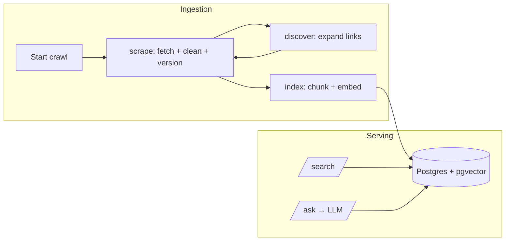
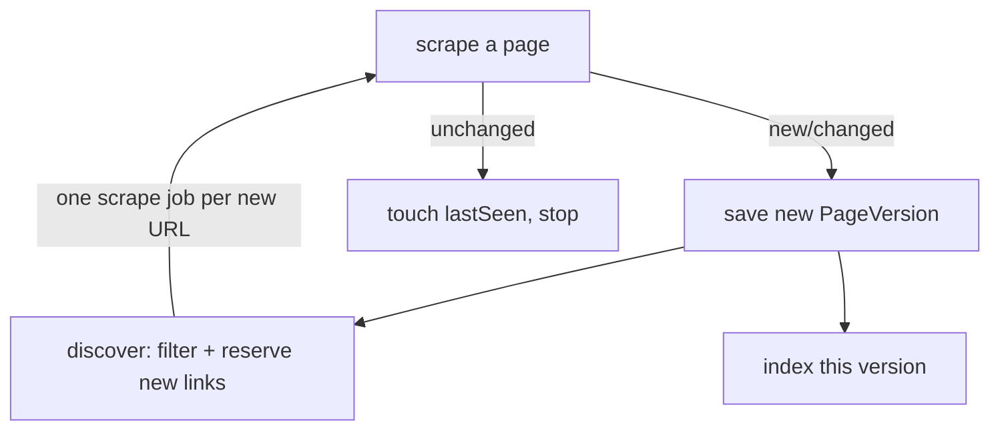
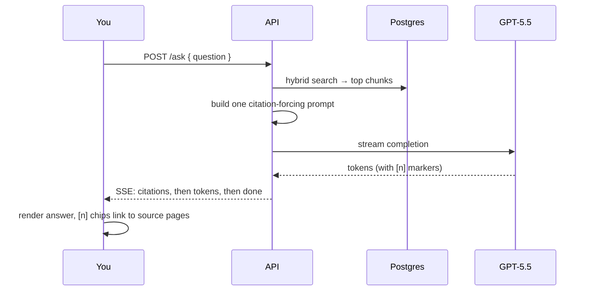

# How it works — a guided walkthrough

This is the narrative version of the system: what actually happens, step by
step, when you crawl a site and when you ask it a question. For the reference
material — component diagram, full API table, data model, the exact per-file
responsibilities — see [`architecture.md`](architecture.md). This doc is meant
to be read top to bottom.

---

## The 10,000-foot view

The system has two halves that meet in one Postgres database:

1. **Ingestion** — crawl web pages, clean them into Markdown, version every
   change, then chunk + embed them into a vector index. This is the slow,
   distributed, fault-tolerant part.
2. **Serving** — answer searches and questions over that indexed content, with
   citations. This is the fast, read-mostly part.

Nothing in ingestion talks to serving directly — they're decoupled through the
database. You can crawl while people search; the newest crawled pages simply
start showing up in results as they finish indexing.

---

## The moving parts (in plain terms)

| Piece | What it is | What it does |
|---|---|---|
| **Postgres + pgvector** | the one database | stores sources, pages, every version, chunks, and the embedding vectors |
| **Redis** | in-memory store | holds the job queues **and** the per-crawl coordination counters |
| **api** (Fastify) | HTTP server | search, ask (streaming), admin, and enqueues crawls |
| **worker** (BullMQ) | the crawl engine | runs the `scrape`, `discover`, and `index` jobs — **you run several of these** |
| **web** (Next.js) | the UI | public search/ask pages + the operator admin panel |
| **scheduler** | a small loop | every 5 min, rescues crawl runs that got stuck |

The important idea: **workers are interchangeable and disposable.** They share
nothing except Redis and Postgres, so you can run 1 or 10 of them, and you can
kill one at any moment without losing work (more on that at the end).

---

## Flow 1 — Ingestion: what happens when you start a crawl

You click **Start crawl** on a source in the admin panel (or `POST
/sources/:id/crawl`). Here's the whole journey of that crawl.

### Step 0 — the API opens a tracked run

The API creates a `CrawlRun` row (status `RUNNING`), **reserves** the seed URL
for that run, and drops one `scrape` job onto the queue. "Reserving" a URL means
two things happen together: it's recorded as *seen* (so nothing crawls it
twice), and the run's outstanding-work counter ticks up by one. Then the API
returns immediately — the actual crawling happens in the background on the
workers.

### Step 1 — a scrape worker picks up the job

Any free worker pulls the `scrape` job and runs this gauntlet, bailing early at
the first gate that says no:

1. **Cancelled?** One cheap Redis check. If the run was cancelled, drop the job
   instantly — don't waste a fetch on results nobody wants.
2. **Allowed by robots.txt?** Fetched once per domain and cached 24h. Disallowed
   → skip (and it's logged for the ethics report).
3. **Within the rate limit?** Each domain has a token bucket (`ratePerSecond`).
   If there's no token right now, the worker **doesn't block** — it tells the
   queue "try me again in N ms" and immediately frees itself for other work.
   This is what keeps the fleet polite to a single site without wasting worker
   time sitting idle.
4. **Fetch** — a static page goes through a lightweight HTTP+Cheerio fetch; a
   JS-rendered source goes through headless Playwright/Chromium. (If the origin
   pushes back with a 429/503, the worker opens a shared cooldown for the whole
   domain, so *every* worker backs off, not just this one.)

### Step 2 — clean, dedup, version

The raw HTML is cleaned into Markdown (Readability strips boilerplate, Turndown
converts to Markdown; tables are pulled out separately as structured JSON). Then
the crucial check: **has this page actually changed?** The worker hashes the
cleaned Markdown and compares it to the page's latest stored version.

- **Unchanged** → just touch "last seen" and stop. No new version, no
  re-indexing, no wasted embedding cost.
- **Changed (or brand new)** → write a **new** `PageVersion` (version number
  bumped). Old versions are never overwritten — that's what powers the diff
  viewer and the "content history" story.

### Step 3 — fan out and hand off

If the page is new/changed and we haven't hit the depth limit, the worker
collects the page's links, filters them against the source's allow/deny rules,
and hands the survivors to a **`discover`** job. It also drops an **`index`**
job for the version it just saved. Then it **settles** — the run's
outstanding-work counter ticks back down by one.

### Step 4 — discover expands the frontier

A `discover` job takes that batch of links and, for each genuinely new one,
reserves it (same seen-check + counter bump as the seed) and enqueues a fresh
`scrape` job. Those scrape jobs loop right back to Step 1. This is how a crawl
spreads outward from one seed URL across a whole site — one page at a time,
across however many workers are running.

### Step 5 — index turns text into search

An `index` job chunks the Markdown (heading-aware, ~800 tokens with overlap;
tables become their own chunks), sends the chunks to OpenAI for embeddings, and
upserts them into Postgres with their vectors. Re-indexing a changed page first
deletes the previous version's chunks, so only the latest version is ever
searchable — old versions stay in the DB for history but drop out of search.

### Step 6 — the crawl finishes (or gets rescued)

Every reserved URL eventually settles (done or failed). When the run's
outstanding counter hits zero, exactly one worker observes that and marks the
`CrawlRun` `SUCCEEDED`. If a worker died at just the wrong moment and a run
somehow never reaches zero, the **scheduler** sweeps every 5 minutes and
force-finalizes any run that's been silent for 30+ minutes — a safety net so a
crawl can never hang `RUNNING` forever.

---

## Flow 2 — Serving: what happens when you search or ask

### Search (`/search?q=&mode=`)

Three modes, all reading the same indexed chunks:

- **keyword** — Postgres full-text search (a generated `tsvector` column,
  GIN-indexed). Fast, exact-term matching.
- **semantic** — your query is embedded, then matched by vector similarity
  (pgvector cosine distance, HNSW-indexed). Finds meaning, not just words.
- **hybrid** (default) — runs both and fuses the two ranked lists with
  Reciprocal Rank Fusion, because a keyword score and a cosine distance aren't
  on comparable scales. Usually the best of both.

### Ask (`/ask`) — RAG with citations

This is the headline feature. When you ask a question:

1. **Retrieve** the most relevant chunks (hybrid search).
2. **Build a prompt** that lists those chunks as numbered sources and instructs
   the model to answer *only* from them and cite every claim with `[n]`. There's
   exactly one prompt builder in the codebase — no ad-hoc prompts anywhere.
3. **Stream** the model's answer back token-by-token over Server-Sent Events,
   preceded by the citation list.
4. The UI renders the streaming Markdown and turns each `[n]` into a clickable
   chip that jumps to the exact cited chunk on its source page.

The key guarantee: a citation can never point at a URL the model invented,
because the citation list is built from the actual retrieved chunks, not from
the model's output. (The model can still *misdescribe* a real source — see
[`limitations.md`](limitations.md) — but it can't fabricate one.)

---

## How it stays correct when things go wrong

This is the part the whole architecture is built around. In plain terms:

- **No duplicate work.** A URL is crawled once per run (the "seen" set), and
  identical re-crawls are skipped by content hash — so re-running a crawl is
  cheap and safe.
- **No lost history.** Every content change is a new version; nothing is
  overwritten.
- **Retries and a dead-letter queue.** A failing job retries 5× with growing
  backoff. If it still fails, it lands in the DLQ (visible and retryable in the
  admin panel) rather than vanishing.
- **A worker can die mid-job without losing work.** If a worker is killed while
  processing, its job's lock expires and another worker picks it up. The trickier
  case — a worker dying *between* reserving a URL and creating its scrape job —
  is handled by making that step recoverable: the URL is only skipped once its
  job is *confirmed created*, so a retry re-creates a job that was lost in the
  gap. (This was found and fixed via the chaos test — see
  [`benchmarks.md`](benchmarks.md), Finding 3.)
- **Politeness is fleet-wide.** The per-domain rate limit and origin-pushback
  cooldowns live in Redis, so adding workers never means hammering a site
  harder — the whole fleet shares one budget per domain.
- **Cancellation is instant-ish.** Cancelling a run flips a Redis flag; workers
  check it before doing expensive work, so queued jobs drain out cheaply instead
  of finishing a crawl nobody wants.

---

## Where to look in the code

| You want to understand… | Start here |
|---|---|
| The scrape gauntlet (robots → rate limit → fetch → version) | `apps/worker/src/worker.ts` |
| Link expansion + the lost-job recovery | `apps/worker/src/discover-worker.ts` |
| Chunk → embed → store | `apps/worker/src/index-worker.ts` |
| The crawl-run counters (reserve / settle / finalize) | `packages/scraper/src/crawl-run.ts` |
| Cleaning HTML → Markdown | `packages/processor/src/clean.ts` |
| Retrieval (keyword / semantic / hybrid) | `packages/rag/src/{retrieve,hybrid}.ts` |
| The RAG prompt + streaming orchestration | `packages/rag/src/{prompt,ask}.ts` |
| HTTP routes | `apps/api/src/routes/` |
| The UI pages | `apps/web/app/` |

For the deeper reference — the full component diagram, the complete API route
table, the Prisma data model, and the exact indexing parameters — see
[`architecture.md`](architecture.md).
